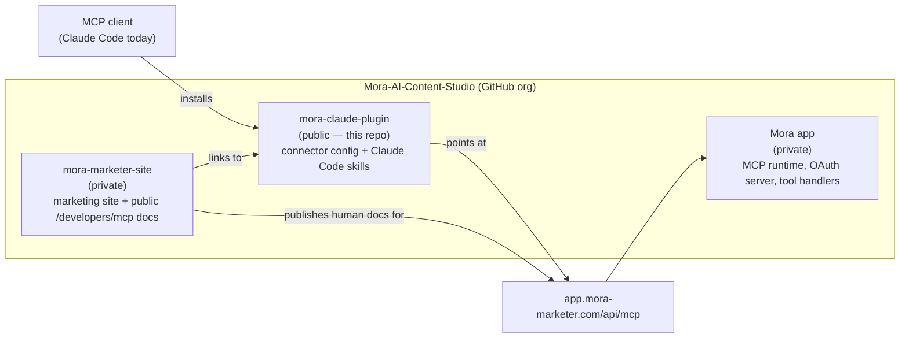
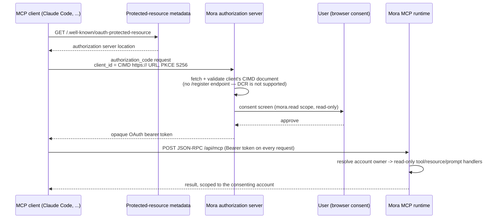

# Mora MCP architecture and contract

This repository is the public Claude Code connector and workflow package. It is not the Mora MCP runtime.
The runtime is hosted by Mora at:

```text
https://app.mora-marketer.com/api/mcp
```

Repository: https://github.com/Mora-AI-Content-Studio/mora-claude-plugin

## Where this fits in Mora's repos

There is deliberately no separate "docs" repository. Mora's public developer documentation
(`/developers/mcp`, `llms.txt`, `llms-full.txt`, `auth.md`) is published from the same site that serves the
product, not a standalone docs deploy — one canonical source instead of a second copy that can drift, which
is also what the contract check below exists to prevent.



The app repo is private by design — it holds real account data, OAuth secrets, and the tool handlers
themselves. This connector repo is public because it contains nothing but configuration and prose: no
runtime code, no credentials, nothing that would be sensitive to publish. That split (public thin connector,
private runtime) is why this repo can be public at all.

## What the connection does

The connection lets an authorized AI client read the signed-in account's own marketing context before
drafting content: brand profile, products, posts, recorded performance, projects, audiences, content angles,
brief research, and revenue attribution. It is designed to reduce confident guesses about a business.

It does not publish, schedule, connect accounts, change billing, write the brand kit, or expose the licensed
third-party Discover corpus. Every currently exposed tool is read-only and the only issuable scope is
`mora.read`.

## Ownership and request flow



A client that cannot present a CIMD `client_id` (i.e. one that only implements Dynamic Client Registration)
fails at the second step, before any tool, resource, or prompt is ever negotiated — see
[Authentication and client compatibility](../README.md#authentication-and-client-compatibility) in the
README for which clients this has actually been verified against.

The client discovers the flow from:

- Protected resource metadata: `https://app.mora-marketer.com/.well-known/oauth-protected-resource`
- Authorization server metadata: `https://app.mora-marketer.com/.well-known/oauth-authorization-server`
- Server card: `https://app.mora-marketer.com/.well-known/mcp/server-card.json`

This repository contributes connector configuration and workflow skills. It never contains private handler
code, database access, credentials, or a replacement OAuth server.

## MCP primitives

Tools are selected by the model. The current ten tools are:

`list_posts`, `get_post_performance`, `get_brand_profile`, `get_brief_workspace`, `list_products`,
`get_revenue_attribution`, `list_projects`, `list_audiences`, `list_content_angles`, and `list_brief_runs`.

The resource `mora://brand/voice` is attached by the user when they want brand voice to remain in context for
the conversation. The prompts `product_hunt_launch_week`, `first_maker_comment`, and
`write_like_what_worked` are named user-invoked workflows, not hidden autonomous actions.

Clients should inspect negotiated capabilities. A client may support tools without supporting resources or
prompts; the connector does not assume every host renders every primitive identically.

## Data and behavior boundaries

- Results are scoped to the account that granted consent.
- Empty catalogue, post, performance, audience, angle, or brief data is returned with explanatory context;
  clients must not invent the missing business facts.
- List results use bounded limits and may include a truncation note directing the client to narrow the query.
- `GET /api/mcp` and `DELETE /api/mcp` return `405` with `Allow: POST, OPTIONS` because this deployment is
  stateless and does not expose a GET stream or session teardown. `OPTIONS` is the CORS preflight.
- The public connector is separate from browser WebMCP. Browser WebMCP is a signed-in, consent-gated app
  capability and is not this HTTP endpoint or its OAuth discovery mechanism.

## Contract source of truth

The live server card is authoritative for primitive names and availability. The checked-in summary is
[`docs/mcp-contract.json`](./mcp-contract.json). Run:

```bash
node scripts/check-mora-mcp-contract.mjs
```

The check compares the summary and public documentation with the live card and verifies the transport
method behavior. It does not claim input/output JSON Schemas that the public server card does not expose.
